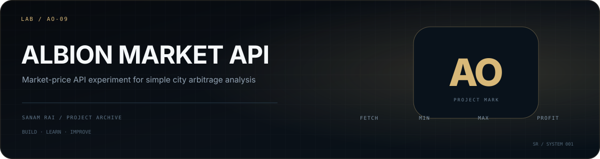

<p align="center">
  
</p>

# Albion Online API Experiment

A small Node.js experiment using the **Albion Online Data API** to compare market prices for an item across cities.

## What it does

The script requests market data, finds the lowest non-zero minimum sell price and the highest non-zero maximum sell price, calculates the difference, and prints a simple buy/sell profit opportunity. The current example uses `T5_TITANIUMBAR`.

## Tech

- Node.js
- Axios
- Albion Online Data API

## Run

```bash
npm install
node server.js
```

## What I learned

This was a focused exercise in consuming a third-party API, transforming returned data, comparing records, and turning raw market data into a simple decision.

## Status

**Small API learning experiment.**

---

**Sanam Rai** · [GitHub profile](https://github.com/SanamRai001)
